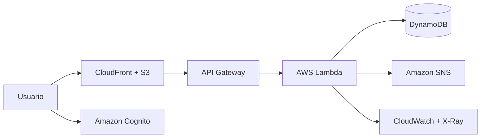

# CloudDesk AWS

Aplicación web para registrar, priorizar y administrar incidentes mediante una arquitectura serverless desplegada en servicios reales de AWS.

> Estado: código listo para validación y despliegue. El repositorio no contiene datos ni servicios simulados. Antes del despliegue, la interfaz muestra un estado de configuración pendiente.

## Qué demuestra

- Desarrollo frontend con HTML, CSS y JavaScript.
- API REST protegida mediante OAuth 2.0 y JWT.
- Funciones serverless con AWS Lambda.
- Persistencia real en Amazon DynamoDB.
- Autenticación mediante Amazon Cognito.
- Notificaciones por correo con Amazon SNS.
- Publicación privada en S3 y distribución HTTPS con CloudFront.
- Logs y trazabilidad mediante CloudWatch y AWS X-Ray.
- Infraestructura reproducible mediante AWS SAM y CloudFormation.
- Pruebas automáticas ejecutadas en GitHub Actions.

## Arquitectura



Los detalles técnicos y decisiones de seguridad están en [docs/ARCHITECTURE.md](docs/ARCHITECTURE.md).

## Funcionalidades

- Registro de tickets con título, descripción y prioridad.
- Estados: abierto, en curso, resuelto y cerrado.
- Búsqueda y filtrado.
- Métricas calculadas desde los tickets almacenados.
- Historial de modificaciones.
- Identificación del usuario que crea y actualiza cada ticket.
- Avisos por correo para tickets nuevos y cambios relevantes.
- Interfaz adaptable a computador y celular.

## Requisitos para desplegar

1. Una cuenta de AWS propia.
2. [AWS CLI](https://docs.aws.amazon.com/cli/latest/userguide/getting-started-install.html).
3. [AWS SAM CLI](https://docs.aws.amazon.com/serverless-application-model/latest/developerguide/install-sam-cli.html).
4. Node.js 22 o posterior.
5. Un usuario o rol de AWS autorizado para crear los recursos del proyecto.

No guardes claves de AWS en este repositorio. Configura AWS CLI con `aws configure sso` o utiliza credenciales temporales.

## Validación local

```bash
npm test
npm run check
```

## Despliegue

Desde la raíz del proyecto:

```bash
export AWS_REGION=us-east-1
export STACK_NAME=clouddesk-aws
export NOTIFICATION_EMAIL=tu-correo@ejemplo.com
export BUDGET_EMAIL=tu-correo@ejemplo.com
export MONTHLY_BUDGET_USD=5
bash scripts/deploy.sh
```

En Windows PowerShell:

```powershell
$env:AWS_REGION="us-east-1"
$env:STACK_NAME="clouddesk-aws"
$env:NOTIFICATION_EMAIL="tu-correo@ejemplo.com"
$env:BUDGET_EMAIL="tu-correo@ejemplo.com"
$env:MONTHLY_BUDGET_USD="5"
.\scripts\deploy.ps1
```

El proceso:

1. Valida la sesión de AWS.
2. Construye y publica la infraestructura.
3. Genera `frontend/config.js` con las direcciones reales.
4. Sube la interfaz a S3.
5. Actualiza CloudFront.
6. Devuelve la URL pública final.

Si agregaste un correo para SNS, AWS enviará una confirmación. Las notificaciones no llegarán hasta aceptar ese mensaje.

## Primer usuario

Después del despliegue, abre la URL de CloudFront y selecciona **Ingresar con AWS**. El formulario alojado por Cognito permite crear la primera cuenta y verificar su correo.

## Costos y seguridad

- DynamoDB utiliza capacidad bajo demanda.
- CloudFront está limitado a la clase de precio más acotada.
- Lambda tiene concurrencia reservada para evitar ejecuciones descontroladas.
- El bucket S3 no es público; CloudFront accede mediante OAC.
- La API rechaza solicitudes sin un JWT válido.
- La tabla y el bucket se conservan al eliminar la infraestructura para evitar pérdida accidental de datos.
- Si se informa `BUDGET_EMAIL`, se crea una alerta al alcanzar el 80 % del presupuesto mensual configurado.

AWS puede generar costos incluso en proyectos pequeños. Revisa Billing y Cost Explorer después del despliegue.

## Documentación del proyecto

- [Arquitectura](docs/ARCHITECTURE.md)
- [Plan de pruebas](docs/TEST_PLAN.md)
- [Guía de contribución](CONTRIBUTING.md)
- [Política de seguridad](SECURITY.md)

## Autoría

Proyecto colaborativo de **Bemati Studio**. Para demostrar contribuciones reales, cada integrante debe trabajar en una rama propia y crear pull requests revisados por el otro integrante.

## Licencia

MIT.
