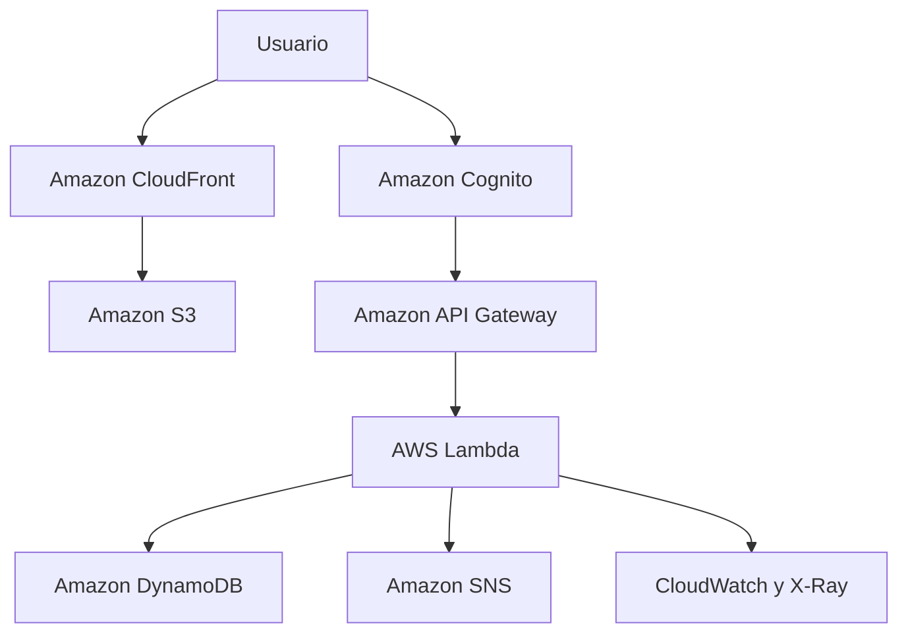

# CloudDesk AWS

Aplicación web para registrar, priorizar y administrar incidentes mediante una arquitectura serverless desplegada en servicios reales de AWS.

> **Estado:** aplicación desplegada y validada en AWS, en la región `us-east-2`. Los tickets se almacenan en una base de datos real y el repositorio no contiene credenciales ni datos simulados.

## Aplicación publicada

[Acceder a CloudDesk](https://dktw4n4fwo3fm.cloudfront.net/)

> El acceso requiere una cuenta autorizada de Amazon Cognito. El registro público de usuarios se encuentra deshabilitado y no se publican credenciales de prueba.

## Qué demuestra

- Desarrollo frontend con HTML, CSS y JavaScript.
- API REST protegida mediante OAuth 2.0, OpenID Connect y JWT.
- Funciones serverless con AWS Lambda.
- Persistencia real en Amazon DynamoDB.
- Autenticación mediante Amazon Cognito.
- Notificaciones por correo con Amazon SNS.
- Bucket privado en Amazon S3.
- Distribución segura mediante Amazon CloudFront y HTTPS.
- Logs y trazabilidad mediante CloudWatch y AWS X-Ray.
- Infraestructura reproducible con AWS SAM y CloudFormation.
- Control de presupuesto mediante AWS Budgets.
- Pruebas automáticas ejecutadas localmente y mediante GitHub Actions.
- Flujo colaborativo con ramas, Pull Requests y revisión de cambios.

## Arquitectura



Los detalles técnicos y las decisiones de seguridad se encuentran en [docs/ARCHITECTURE.md](docs/ARCHITECTURE.md).

## Servicios AWS utilizados

| Servicio | Función en CloudDesk |
|---|---|
| Amazon S3 | Almacena los archivos del frontend |
| Amazon CloudFront | Distribuye la aplicación mediante HTTPS |
| Amazon Cognito | Administra usuarios, autenticación y sesiones |
| Amazon API Gateway | Expone y protege la API |
| AWS Lambda | Ejecuta la lógica del backend |
| Amazon DynamoDB | Almacena permanentemente los tickets |
| Amazon SNS | Envía notificaciones por correo |
| Amazon CloudWatch | Registra ejecuciones, métricas y errores |
| AWS X-Ray | Permite seguir las solicitudes del backend |
| AWS Budgets | Controla el presupuesto mensual |
| AWS CloudFormation | Crea y actualiza los recursos |
| AWS SAM | Construye y despliega la aplicación serverless |

## Funcionalidades

- Inicio y cierre de sesión.
- Registro de tickets con título, descripción y prioridad.
- Estados: abierto, en curso, resuelto y cerrado.
- Búsqueda y filtrado.
- Actualización del estado de los tickets.
- Métricas calculadas desde tickets almacenados.
- Registro de fecha de creación y última actualización.
- Identificación del usuario que crea o actualiza un ticket.
- Avisos por correo para tickets y cambios relevantes.
- Persistencia después de actualizar la página.
- Persistencia después de cerrar y volver a iniciar sesión.
- Interfaz adaptable a computador y celular.

## Flujo de un ticket

1. El usuario inicia sesión mediante Amazon Cognito.
2. Cognito entrega un token JWT.
3. El frontend envía la solicitud a Amazon API Gateway.
4. API Gateway valida el token.
5. AWS Lambda procesa la solicitud.
6. El ticket se guarda en Amazon DynamoDB.
7. Amazon SNS puede enviar una notificación.
8. CloudWatch y X-Ray registran la ejecución.

## Estructura del proyecto

```text
clouddesk-aws/
├── backend/
│   ├── src/
│   └── tests/
├── docs/
│   ├── ARCHITECTURE.md
│   └── TEST_PLAN.md
├── frontend/
│   ├── index.html
│   ├── app.js
│   ├── styles.css
│   └── config.template.js
├── infrastructure/
│   └── template.yaml
├── scripts/
│   ├── deploy.ps1
│   └── deploy.sh
├── package.json
├── CONTRIBUTING.md
├── SECURITY.md
└── README.md
```

## Documentación del proyecto

- [Arquitectura](docs/ARCHITECTURE.md)
- [Plan de pruebas](docs/TEST_PLAN.md)
- [Guía de contribución](CONTRIBUTING.md)
- [Política de seguridad](SECURITY.md)

## Requisitos para desplegar

1. Una cuenta de AWS.
2. [AWS CLI](https://docs.aws.amazon.com/cli/latest/userguide/getting-started-install.html).
3. [AWS SAM CLI](https://docs.aws.amazon.com/serverless-application-model/latest/developerguide/install-sam-cli.html).
4. Node.js 24.
5. npm.
6. PowerShell en Windows o una terminal compatible en Linux/macOS.
7. Un usuario o rol autorizado para crear los recursos del proyecto.

No se deben guardar claves, contraseñas ni credenciales AWS en el repositorio. Se recomienda utilizar credenciales temporales mediante AWS CLI.

## Validación local

Instalar las dependencias:

```bash
npm install
```

Ejecutar las pruebas:

```bash
npm test
```

Revisar la sintaxis:

```bash
npm run check
```

Validar la infraestructura:

```bash
sam validate --lint --template-file ./infrastructure/template.yaml
```

Construir la aplicación:

```bash
sam build --template-file ./infrastructure/template.yaml
```

## Despliegue en Linux o macOS

Desde la raíz del proyecto:

```bash
export AWS_PROFILE=clouddesk
export AWS_REGION=us-east-2
export STACK_NAME=clouddesk-aws
export NOTIFICATION_EMAIL=tu-correo@ejemplo.com
export BUDGET_EMAIL=tu-correo@ejemplo.com
export MONTHLY_BUDGET_USD=5

bash scripts/deploy.sh
```

## Despliegue en Windows PowerShell

Desde la carpeta del proyecto:

```powershell
$env:AWS_PROFILE="clouddesk"
$env:AWS_REGION="us-east-2"
$env:STACK_NAME="clouddesk-aws"
$env:NOTIFICATION_EMAIL="tu-correo@ejemplo.com"
$env:BUDGET_EMAIL="tu-correo@ejemplo.com"
$env:MONTHLY_BUDGET_USD="5"

.\scripts\deploy.ps1
```

Los correos deben reemplazarse por direcciones reales. No se deben publicar direcciones personales en el repositorio.

El proceso de despliegue:

1. Valida la sesión de AWS.
2. Construye la aplicación con AWS SAM.
3. Crea o actualiza la infraestructura mediante CloudFormation.
4. Genera `frontend/config.js` con la configuración real.
5. Sube el frontend a Amazon S3.
6. Actualiza la distribución de CloudFront.
7. Devuelve la URL final de la aplicación.

Si se configura Amazon SNS, AWS enviará un correo de confirmación. Las notificaciones no funcionarán hasta seleccionar **Confirm subscription**.

## Administración de usuarios

El registro público está deshabilitado mediante la configuración del User Pool:

```yaml
AdminCreateUserConfig:
  AllowAdminCreateUserOnly: true
```

Los usuarios existentes continúan funcionando. Las nuevas cuentas deben ser creadas por una persona administradora desde Amazon Cognito.

No se deben publicar usuarios ni contraseñas en este repositorio.

## Pruebas realizadas

- Normalización de solicitudes válidas.
- Rechazo de títulos demasiado cortos.
- Validación de prioridades.
- Restricción de campos editables.
- Rechazo de actualizaciones sin campos permitidos.
- Cálculo de métricas desde tickets reales.
- Inicio y cierre de sesión.
- Creación de tickets.
- Búsqueda y filtrado.
- Actualización del estado.
- Persistencia después de actualizar la página.
- Persistencia después de volver a iniciar sesión.
- Validación de la plantilla AWS SAM.
- Construcción correcta mediante `sam build`.
- Despliegue real en la región `us-east-2`.

Las seis pruebas automáticas incluidas en el backend se ejecutan mediante:

```bash
npm test
```

## Costos y seguridad

- DynamoDB utiliza capacidad bajo demanda.
- CloudFront utiliza una clase de precio acotada.
- El bucket S3 no tiene acceso público directo.
- CloudFront accede al bucket mediante Origin Access Control.
- La API rechaza solicitudes sin un JWT válido.
- El registro público de Cognito está deshabilitado.
- El usuario raíz de AWS tiene MFA y no posee claves de acceso.
- Las credenciales AWS no están almacenadas en GitHub.
- Los cambios del repositorio se incorporan mediante ramas y Pull Requests.
- La rama `main` está protegida.
- La tabla y el bucket se conservan al eliminar la infraestructura para reducir el riesgo de pérdida accidental.
- AWS Budgets puede emitir una alerta al alcanzar el 80 % del presupuesto mensual configurado.

La propiedad de concurrencia reservada de Lambda no está configurada porque algunas cuentas nuevas de AWS no poseen cuota suficiente para utilizarla.

AWS puede generar costos incluso en proyectos pequeños. Se recomienda revisar periódicamente **Billing**, **Cost Explorer** y **AWS Budgets**.

## Limitaciones actuales

Los tickets son creados manualmente por usuarios autorizados. Actualmente CloudDesk no consulta instancias EC2 ni genera incidentes automáticamente desde alarmas de CloudWatch.

La infraestructura AWS utilizada por la aplicación es real, pero el módulo de monitoreo automático corresponde a una fase posterior.

## Próximas mejoras

- Generación automática de incidentes desde CloudWatch y EventBridge.
- Consulta de instancias EC2.
- Panel de alarmas y métricas operacionales.
- Integración con AWS Systems Manager.
- Incorporación de resultados de Amazon Inspector.
- Roles diferenciados para administradores y usuarios.
- Mayor cobertura de pruebas automáticas.
- Capturas del funcionamiento en la documentación.
- Integración con el portafolio de Bemati Studio.

## Autoría

Proyecto colaborativo desarrollado por **Bemati Studio**:

- [Bernardita](https://github.com/bernardita03)
- [Matías](https://github.com/matiasperezsilva)

Cada integrante trabaja en ramas independientes y crea Pull Requests revisados por el otro integrante.

## Licencia

Este proyecto se distribuye bajo la licencia MIT.
